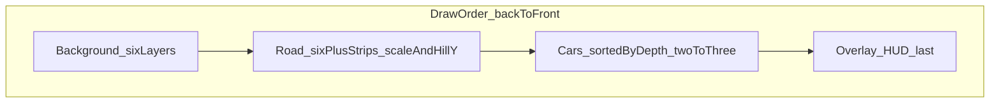

# Scenic drive / parallax stage (design)

This document is the **source of truth** for a SEGA arcade–inspired **pseudo-depth** presentation: stacked parallax backgrounds, scaled road strips toward a horizon, vertical undulation for hills, multiple cars, and a HUD overlay that never sits under gameplay.

Implementation is **not** required to match this doc until a driving scene ships; agents should follow these agreements when adding or refactoring that stack.

## Purpose

- **Look**: multi-layer parallax, road depth via **per-strip scale**, **hill feel** via coordinated **vertical offset** of road bands (not independent “floating” strips).
- **Gameplay read**: at least **two** cars racing, with a **third** car as a later extension; correct **occlusion** when several vehicles share the same ahead/behind relationship to the camera.

## Draw order (back → front)

Render from farthest to nearest; **HUD/overlay is always last** (highest intended z-order for UI).

1. **Background (six layers)**  
   Independent horizontal motion (and optional differential rates). **Lateral offset** (and related scroll) reflects **vehicle yaw / steering** so the environment slides relative to the car, selling orientation.

2. **Road (at least six strips / depth bands)**  
   Each band is **smaller** toward the **horizon** and **larger** near the camera to simulate depth. **Vertical translation** per band comes from a **single shared hill profile** over track distance (incline, decline, crest)—**not** unrelated per-layer bounce, so seams stay coherent. **Horizon discipline**: far bands stay locked to a believable vanishing region; sky/background rules may anchor differently so the whole sky does not detach from the road illusion.

3. **Cars (two minimum, three later)**  
   One logical **cars** layer **above** the road and **below** the overlay. **Per frame**, sort draws by a **depth key** (e.g. track distance along the spline, pseudo-z, or scale). Avoid three **fixed global** sprite layers labeled ahead/current/behind only—two opponents can both be ahead or both behind; sorting keeps occlusion correct.

4. **Overlay / HUD**  
   Drawn **last** so controls, prices, timers, and modals stay on top. Aligns with current [`Overlay`](../src/ui/Overlay.tsx) stacking.

## Math / data contract (conceptual)

Maintain one **track state** (or equivalent) derived from simulation time / distance:

- **Curvature** → drives background **lateral** motion and road **horizontal bend** (if modeled).
- **Pitch / hill** → drives **vertical offset** of each road strip as a function of **strip depth** and distance (nearer strips move more with the same hill).
- **Car positions** → world or track-relative coordinates → **sort key** for draw order.

Rendering may start as **DOM layers** (divs/images/CSS transforms) inside the fixed logical stage; if layer count or jank becomes an issue, a later **Canvas 2D or WebGL** pass can implement the same contract.

## Integration in this repo

| Concern | Location |
|--------|----------|
| Logical resolution and fit | [`Stage.tsx`](../src/ui/Stage.tsx), [`useStageFitScale.ts`](../src/ui/useStageFitScale.ts), [`constants.ts`](../src/config/constants.ts) |
| Scene vs overlay siblings | [`App.tsx`](../src/App.tsx) — children inside `Stage` (today: `scene-placeholder`, then `Overlay`) |
| Z-order for HUD | [`index.css`](../src/index.css) — e.g. `.overlay` at `z-index: 20`, `.video-overlay-root` at `30` |

**Z-index policy**: reserve **world/scene content below `20`** unless overlay policy is intentionally redesigned. Do not place gameplay sprites above the overlay **unless** the product owner explicitly changes HUD behavior.

The existing boxing scene uses manifest-driven stacking (see comment in `index.css` referencing [`mobileAssetManifest.ts`](../src/ui/mobileAssetManifest.ts)). A driving scene **either** replaces that mode’s stack **or** coexists with clearly separated z-bands; do not mix conventions without documenting the new map.

## Assets

Car, road, and scenery images are **out of band** for this spec: filenames, resolutions, and atlases should be documented when art lands. Stub layers (colors or placeholders) are fine until assets exist.
